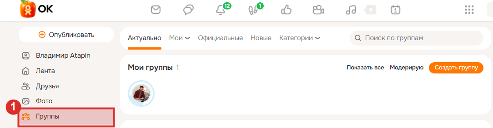
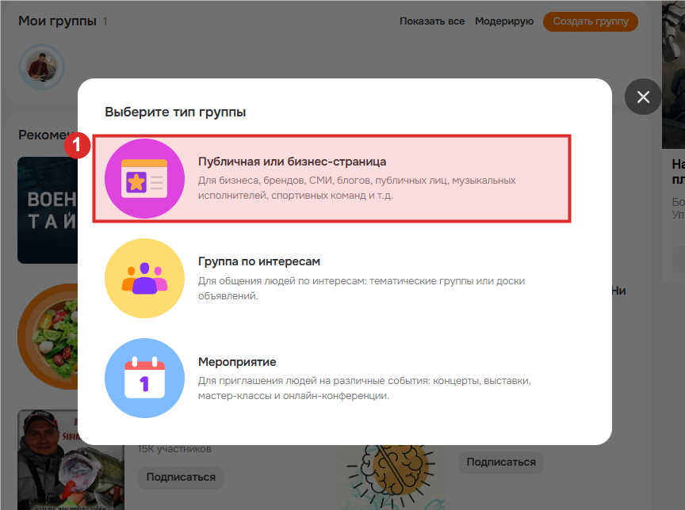
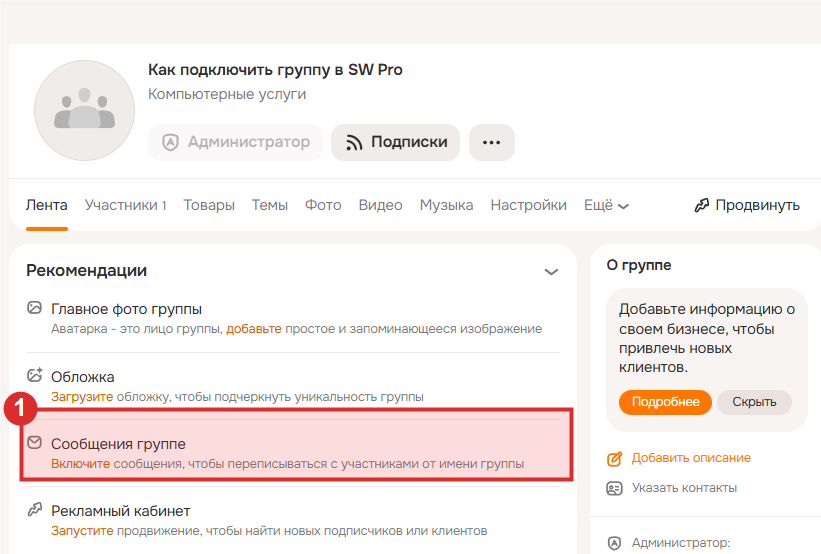
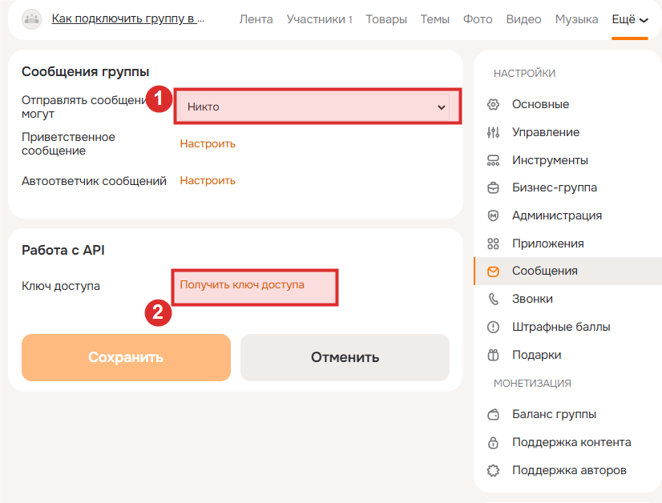
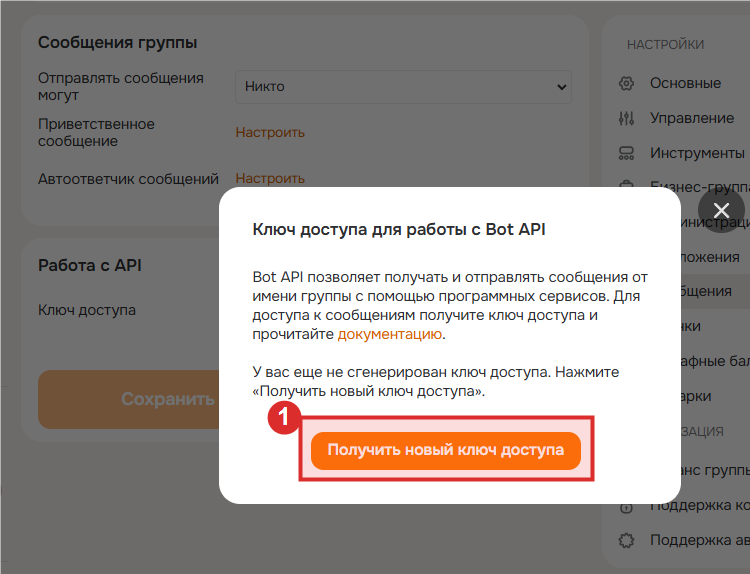
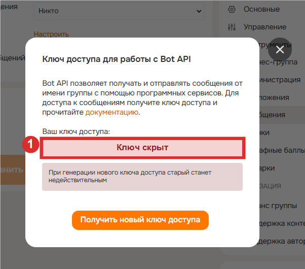

# Подключение группы OK

Для кого: суперадминистратор, лидер и консультант.

OK подключается как полноценный канал живого чата: группа отправляет сообщения клиенту, а его ответы автоматически появляются в SWPro.

## Что нужно заранее

- Ваша группа OK с включёнными личными сообщениями.
- Числовой ID этой группы.
- Bot API token группы. Это секретный ключ, его нельзя публиковать или пересылать в обычных сообщениях.
- Право приложения OK `BOT_API_INIT`. Оно нужно, чтобы приложение могло показать клиенту системное окно разрешения личных сообщений. Если право ещё не выдано, его запрашивают у поддержки OK один раз для приложения.

## Подключение

### 1. Откройте или создайте группу

В desktop-версии Одноклассников в левом меню откройте **«Группы»**.

Если группы ещё нет, нажмите «Создать группу» и выберите **«Публичная или бизнес-страница»**. Если группа уже создана, этот шаг пропустите.

### 2. Включите личные сообщения группе

Откройте нужную группу, перейдите в её **«Настройки»** и выберите раздел **«Сообщения»**. В пункте «Отправлять сообщения могут» включите вариант, при котором пользователи могут писать группе (обычно «Все» или аналогичный вариант), затем сохраните изменения.

### 3. Получите Bot API token

В этом же разделе в блоке «Работа с API» нажмите **«Получить ключ доступа»**, а в открывшемся окне — **«Получить новый ключ доступа»**.

Скопируйте выданный ключ и сразу сохраните его в SWPro. Ключ — секрет: не отправляйте его в чат, не публикуйте в инструкции и не показывайте на скриншотах. На иллюстрации значение намеренно скрыто.

Если ключ уже попал на скриншот, в письмо или постороннему человеку, нажмите **«Получить новый ключ доступа»**: старый ключ станет недействительным.

### 4. Добавьте группу в SWPro

1. Найдите числовой ID группы в настройках или адресе группы. Короткое название в адресе не подходит.
2. В SWPro откройте **Подключения** → **Добавить**.
3. Выберите платформу **OK**.
4. Заполните название, **ID группы OK** и **Токен Bot API группы OK**. Для OK не нужны строка, которую должен вернуть сервер, и секретный ключ: это настройки VK Callback API и в форме OK не показываются.
5. Сохраните запись.

После сохранения SWPro автоматически зарегистрирует защищённый webhook у OK. Если всё прошло успешно, в форме появится время в поле **OK webhook подключён**. Никакой URL вручную вводить не нужно.

## Что делает клиент

В приложении OK на странице «Связаться» клиент видит блок **Личные сообщения OK**. Он нажимает **Разрешить сообщения OK** и подтверждает системное окно Одноклассников. После этого консультант может писать клиенту через живой чат, «Что сделать сегодня» и AI-студию.

Если клиент открыл обычный Web-мини-сайт, в этом же блоке будет кнопка **Открыть диалог OK**. Она ведёт в официальный диалог с группой: клиенту достаточно написать группе первое сообщение, после чего ответы также придут в общий чат SWPro.

## Проверка и неполадки

- Откройте подключение в SWPro: поле **Последняя ошибка Callback** должно быть пустым.
- Отправьте тестовое сообщение из живого чата клиенту, который уже разрешил сообщения OK.
- Попросите клиента ответить. Его ответ должен появиться в том же чате SWPro.
- Если webhook не подключился, проверьте числовой ID группы и Bot API token, затем снова сохраните запись. SWPro повторит подключение.

Если токен попал постороннему, сразу отзовите его в OK, создайте новый и сохраните подключение заново.
